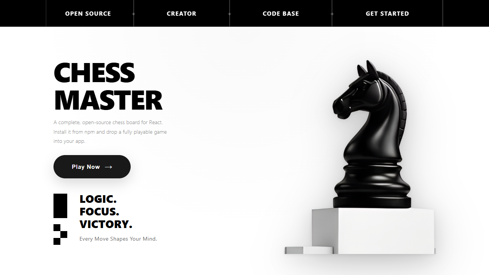
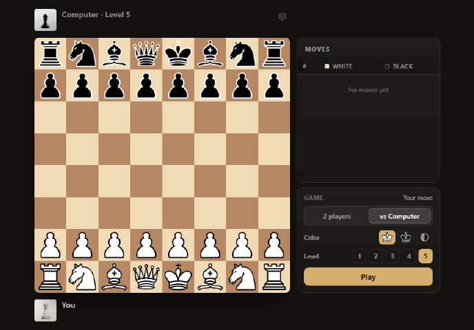
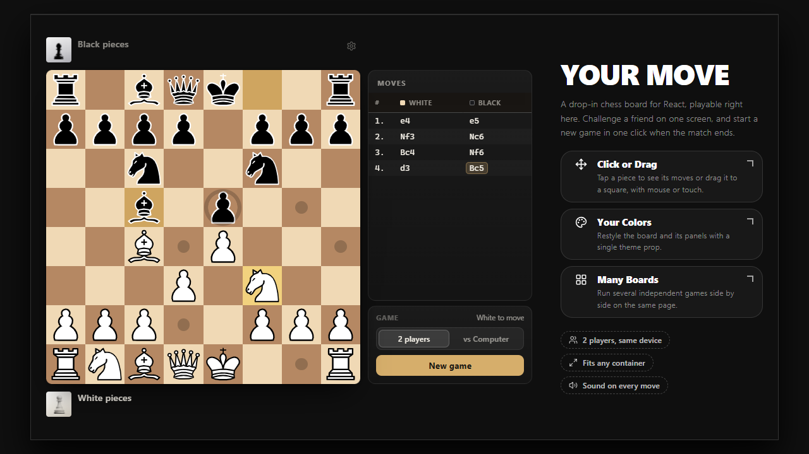
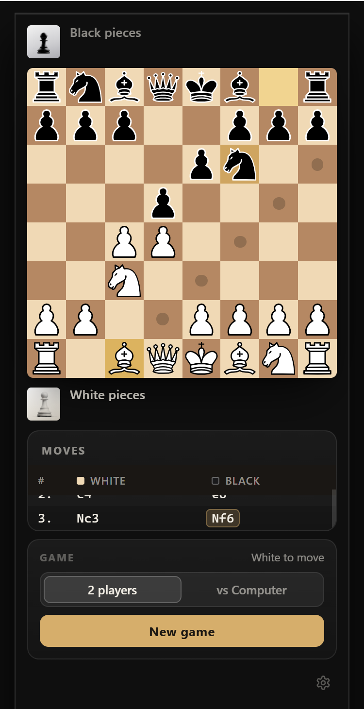
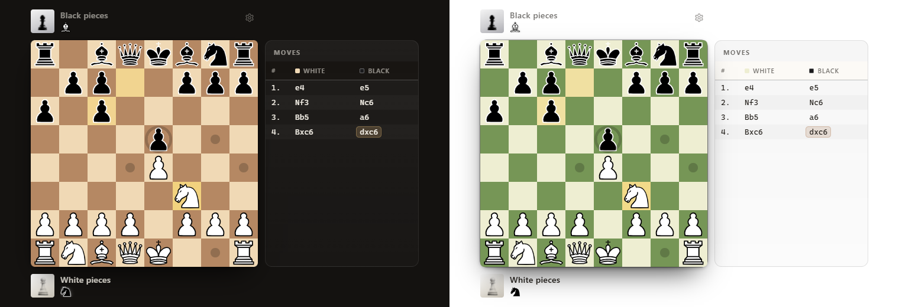

<div align="center">

# ♟️ CHESS MASTER

**LOGIC. FOCUS. VICTORY.**

A complete chess game for the browser, and the open-source React component behind it.



[](https://chess-master-cvg0svtvz-brayangutis-projects.vercel.app/)
[](https://www.npmjs.com/package/@brayanguti/react-chessmaster)
[](LICENSE)

</div>

---

## The game

Play a friend on the same screen, or take on the computer at five levels. Every rule is in:
castling, en passant, promotion, check, checkmate and stalemate.

<div align="center">
  
</div>

- **Click or drag** — pick a piece to see its moves, or drag it; mouse and touch.
- **vs Computer** — five levels, choose your color; the board turns around when you play black.
- **Your layout** — players, captured pieces, move history and the game panel, each one on demand.
- **Saved games** — reload the page and pick up where you left off.

<table>
  <tr>
    <td width="68%"></td>
    <td width="32%"></td>
  </tr>
  <tr>
    <td align="center"><sub>Desktop</sub></td>
    <td align="center"><sub>Phone</sub></td>
  </tr>
</table>

## The component

The whole game is one React component, published on npm as
[`@brayanguti/react-chessmaster`](packages/react-chessmaster). Drop it into any React app:

```bash
npm install @brayanguti/react-chessmaster
```

```tsx
import { ChessBoard } from '@brayanguti/react-chessmaster'

<ChessBoard showMoveHistory showPlayerBadges defaultMode="computer" />
```

No stylesheet to import, nothing to configure. It fits any container, works with React 18 and 19,
and is ready for Next.js. Restyle it with a couple of props:

<div align="center">
  
</div>

👉 Every prop, the engine and theming: **[package documentation](packages/react-chessmaster/README.md)**

## Run it locally

```bash
git clone https://github.com/BrayanGuti/ChessMaster.git
cd ChessMaster && npm install
npm run dev      # the website on http://localhost:5173
```

```
packages/react-chessmaster/   the npm package (the chess component)
apps/web/                     this website, built on the package
```

`npm test` runs the chess rules test suite · `npm run build:package` builds the package ·
`npm run lint` checks the code.

## Built with

[](https://react.dev/)
[](https://www.typescriptlang.org/)
[](https://github.com/pmndrs/zustand)
[](https://vite.dev/)
[](https://vitest.dev/)

The computer opponent is [js-chess-engine](https://github.com/josefjadrny/js-chess-engine) (MIT),
running in a Web Worker so the page never freezes.

---

<div align="center">

Built by **[Brayan Gutierrez](https://github.com/BrayanGuti)** · [MIT License](LICENSE)

⭐ If you like this project, consider giving it a star!

</div>
